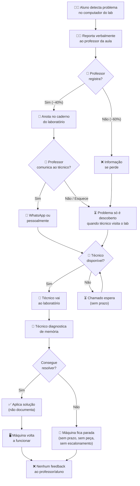

# Mapeamento do Processo AS-IS — Gestão de Incidentes

> **Projeto:** Implantação de Gestão de Incidentes ITIL v4 na Escola Técnica InfoPro
> **Processo:** Tratamento de incidentes de TI nos laboratórios
> **Notação:** BPMN 2.0 (simplificada)
> **Ferramenta:** Draw.io (arquivo editável: `processo-as-is.drawio`)

---

## Diagrama em Mermaid

## Raias (Swimlanes)

| Raia / Ator | Atividades |
|-------------|-----------|
| **Aluno** | Detecta problema → Reporta verbalmente ao professor |
| **Professor** | Recebe relato → Anota no caderno (às vezes) → Comunica ao técnico via WhatsApp (às vezes) |
| **Técnico de TI** | Recebe comunicação (se chegar) → Vai ao lab → Diagnostica → Resolve ou não → Sem feedback |
| **Coordenação** | Nenhuma atividade no fluxo atual — só é acionada em crises |

## Descrição das Atividades

| # | Atividade | Responsável | Entrada | Saída | Tempo Médio | Problemas |
|---|----------|-------------|---------|-------|-------------|-----------|
| 1 | Detectar problema | Aluno | Falha no computador | Relato verbal | Imediato | Descrição vaga, sem dados técnicos |
| 2 | Reportar ao professor | Aluno | Relato verbal | Professor ciente | 1-5 min | Professor pode estar ocupado com aula |
| 3 | Registrar no caderno | Professor | Relato do aluno | Anotação no caderno | 2 min | ~60% não registra; quando registra, sem padrão |
| 4 | Comunicar ao técnico | Professor | Anotação / memória | WhatsApp enviado | 0-24h | Atraso, esquecimento, mensagem incompleta |
| 5 | Deslocamento ao lab | Técnico | Mensagem recebida | Presença física no lab | 30min-48h | Depende de disponibilidade, sem priorização |
| 6 | Diagnosticar problema | Técnico | Máquina com defeito | Diagnóstico verbal | 15-60 min | De memória, sem base de conhecimento |
| 7 | Resolver (ou não) | Técnico | Diagnóstico | Máquina ok ou parada | 30min-5 dias | Sem peças, sem escalonamento, sem prazo |
| 8 | (Não há) Feedback | — | — | — | — | INEXISTENTE — Ninguém é avisado |

**Tempo total ponta-a-ponta (MTTR): 5,3 dias úteis em média**

## Pontos de Melhoria Identificados

| # | Ponto no Fluxo | Problema | Oportunidade TO-BE |
|---|---------------|---------|---------------------|
| 1 | Relato verbal do aluno | Informação se perde, sem dados técnicos | Formulário digital com campos obrigatórios |
| 2 | Registro em caderno | 60% não registra, sem padrão | Formulário online como único canal de registro |
| 3 | WhatsApp como canal | Mensagens perdidas, informal | Service Desk com fila e rastreamento |
| 4 | Priorização por "feeling" | Labs inteiros parados por problema menor | Matriz de prioridade (impacto × urgência) |
| 5 | Diagnóstico de memória | Reincidência de 34% | Base de conhecimento com soluções documentadas |
| 6 | Sem escalonamento | Problema fica parado sem resolver | Fluxo N1→N2→N3 com gatilhos de tempo |
| 7 | Sem SLA | Sem meta de tempo, sem urgência | SLAs por prioridade (P1: 4h, P2: 8h...) |
| 8 | Zero feedback | Usuário não sabe se foi resolvido | Notificação automática de status |
