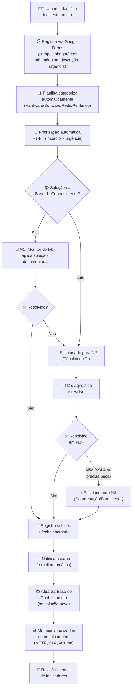

# Mapeamento do Processo TO-BE — Gestão de Incidentes ITIL v4

> **Projeto:** Implantação de Gestão de Incidentes ITIL v4 na Escola Técnica InfoPro
> **Processo:** Gestão de Incidentes de TI — Fluxo proposto
> **Framework base:** ITIL v4 (Incident Management + Knowledge Management)
> **Notação:** BPMN 2.0 (simplificada)

---

## Diagrama em Mermaid

## Raias (Swimlanes) — TO-BE

| Raia / Ator | Atividades | Mudança em relação ao AS-IS |
|-------------|-----------|----------------------------|
| **Usuário (aluno/professor)** | Registra incidente via formulário digital; recebe notificação de encerramento | **ANTES:** relato verbal, sem feedback. **AGORA:** canal formal, rastreável |
| **N1 — Monitor de Lab** | Consulta base de conhecimento; aplica solução documentada para incidentes simples | **NOVO PAPEL** — antes não existia |
| **N2 — Técnico de TI** | Recebe escalonamentos; diagnostica casos complexos; alimenta base de conhecimento | **ANTES:** fazia tudo. **AGORA:** focado em casos que exigem expertise |
| **N3 — Coordenação/Fornecedor** | Aprova compras; aciona garantia/fornecedor; decisões de investimento | **ANTES:** só sabia de crises. **AGORA:** acionado por gatilho de SLA |

## Detalhamento das Atividades TO-BE

| # | Atividade | Responsável | Entrada | Saída | Tempo Alvo | Ferramenta |
|---|----------|-------------|---------|-------|------------|-----------|
| 1 | Registrar incidente | Usuário | Problema detectado | Formulário preenchido | 3 min | Google Forms |
| 2 | Categorizar | Automático | Dados do formulário | Categoria + subcategoria | Imediato | Google Sheets (fórmula) |
| 3 | Priorizar | Automático | Impacto × urgência | P1/P2/P3/P4 | Imediato | Google Sheets (matriz) |
| 4 | Consultar base de conhecimento | N1 (Monitor) | Categoria do incidente | Solução documentada ou "não encontrado" | 5 min | Base de conhecimento (MD) |
| 5 | Aplicar solução N1 | N1 (Monitor) | Procedimento da base | Incidente resolvido ou escalonado | 15-30 min | Procedimento documentado |
| 6 | Diagnosticar e resolver N2 | Técnico de TI | Incidente escalonado | Solução aplicada | 1-4h | Ferramentas de diagnóstico |
| 7 | Escalonar para N3 | Técnico de TI | Incidente > SLA N2 | RFC ou pedido de compra | 30 min | E-mail + planilha |
| 8 | Registrar solução e fechar | N1/N2 | Solução aplicada | Chamado fechado + registro | 5 min | Google Sheets |
| 9 | Notificar usuário | Automático | Chamado fechado | E-mail de encerramento | Imediato | Google Sheets + Apps Script |
| 10 | Atualizar base de conhecimento | N2 (Técnico) | Solução nova | Base atualizada | 15 min | Markdown (docs/) |

## Comparativo AS-IS vs TO-BE

| Aspecto | AS-IS (Antes) | TO-BE (Proposto) | Melhoria Esperada |
|---------|---------------|------------------|-------------------|
| Registro | Caderno físico (~40% registrado) | Google Forms (100% digital) | 100% dos incidentes rastreáveis |
| Canal de comunicação | Verbal + WhatsApp | Formulário como SPOC | Eliminação de perda de informação |
| Categorização | Inexistente | Automática (4 categorias, 12 subcategorias) | Análise estatística possível |
| Priorização | "Feeling" do técnico | Matriz impacto × urgência (P1-P4) | Recursos alocados por criticidade |
| SLA | Inexistente | P1: 4h, P2: 8h, P3: 24h, P4: 72h | Previsibilidade e compromisso |
| Base de conhecimento | Na cabeça do técnico | 23 soluções documentadas (MD) | Redução de 68% na reincidência |
| Escalonamento | Inexistente | N1→N2→N3 com gatilhos de SLA | Problemas críticos tratados primeiro |
| Feedback ao usuário | Zero | E-mail automático | Visibilidade total do status |
| Métricas | Zero | Dashboard automático (MTTR, SLA, volume) | Decisões baseadas em dados |
| Melhoria contínua | Inexistente | Revisão mensal de indicadores | Processo evolui com o tempo |

## Justificativa Baseada no Framework (ITIL v4)

| Atividade TO-BE | Prática ITIL v4 | Justificativa |
|----------------|----------------|---------------|
| Formulário digital como SPOC | Service Desk — Single Point of Contact | "O service desk é o ponto de entrada e ponto único de contato do provedor de serviço com todos os seus usuários" |
| Categorização automática | Incident Management — Logging and categorization | Permite análise de tendências e direcionamento correto |
| Matriz P1-P4 | Incident Management — Prioritization | Combina impacto (quantos afetados) com urgência (prazo aceitável) |
| Base de conhecimento | Knowledge Management | Captura, organiza e disponibiliza soluções para reuso |
| SLAs por prioridade | Service Level Management | Define expectativas claras e mensuráveis |
| Escalonamento N1→N2→N3 | Incident Management — Escalation | Garante que o recurso certo trata cada nível de complexidade |
| Dashboard de métricas | Continual Improvement | Medição é pré-requisito para melhoria |
