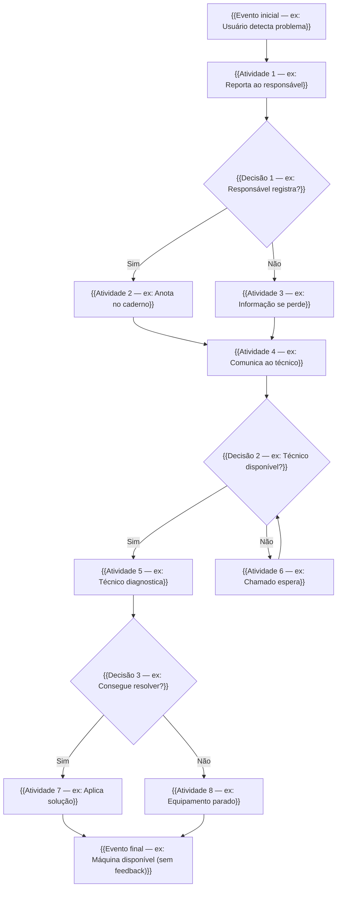

# Mapeamento do Processo AS-IS

> **Projeto:** {{TÍTULO_DO_PROJETO}}
> **Processo:** {{Nome do processo mapeado}}
> **Notação:** BPMN 2.0 (simplificada)
> **Ferramenta sugerida:** Draw.io / Bizagi / Lucidchart

---

## Diagrama em Mermaid (versão simplificada)

<!--
  Use este diagrama como RASCUNHO para depois criar a versão visual no Draw.io.
  Substitua os {{placeholders}} pelo fluxo real do processo atual.
-->

## Raias (Swimlanes)

| Raia / Ator | Atividades |
|-------------|-----------|
| **{{Ator 1 — ex: Usuário/Aluno}}** | {{Lista de atividades deste ator}} |
| **{{Ator 2 — ex: Professor}}** | {{Lista de atividades}} |
| **{{Ator 3 — ex: Técnico de TI}}** | {{Lista de atividades}} |
| **{{Ator 4 — ex: Coordenação}}** | {{Lista de atividades (se aplicável)}} |

## Descrição das Atividades

| # | Atividade | Responsável | Entrada | Saída | Tempo Médio | Problemas |
|---|----------|-------------|---------|-------|-------------|-----------|
| 1 | {{Atividade}} | {{Quem}} | {{O que recebe}} | {{O que produz}} | {{Tempo}} | {{Gargalos}} |
| 2 | {{Atividade}} | {{Quem}} | {{Entrada}} | {{Saída}} | {{Tempo}} | {{Problemas}} |
| 3 | {{Atividade}} | {{Quem}} | {{Entrada}} | {{Saída}} | {{Tempo}} | {{Problemas}} |

## Pontos de Melhoria Identificados

| # | Ponto no Fluxo | Problema | Oportunidade de Melhoria |
|---|---------------|---------|--------------------------|
| 1 | {{Onde no fluxo}} | {{Qual problema}} | {{O que pode ser feito}} |
| 2 | {{Onde}} | {{Problema}} | {{Melhoria}} |
| 3 | {{Onde}} | {{Problema}} | {{Melhoria}} |
