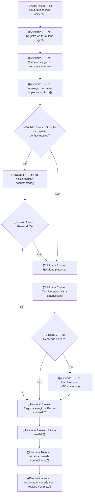

# Mapeamento do Processo TO-BE

> **Projeto:** {{TÍTULO_DO_PROJETO}}
> **Processo:** {{Nome do processo proposto}}
> **Framework base:** {{ITIL v4 / COBIT 2019 / ISO 27001}}
> **Notação:** BPMN 2.0 (simplificada)

---

## Diagrama em Mermaid

## Raias (Swimlanes) — TO-BE

| Raia / Ator | Atividades | Mudança em relação ao AS-IS |
|-------------|-----------|----------------------------|
| **{{Ator 1}}** | {{Atividades}} | {{O que mudou}} |
| **{{Ator 2}}** | {{Atividades}} | {{O que mudou}} |
| **{{Ator 3}}** | {{Atividades}} | {{O que mudou}} |

## Detalhamento das Atividades TO-BE

| # | Atividade | Responsável | Entrada | Saída | Tempo Alvo | Ferramenta |
|---|----------|-------------|---------|-------|------------|-----------|
| 1 | {{Atividade}} | {{Quem}} | {{Entrada}} | {{Saída}} | {{Meta}} | {{Ferramenta}} |
| 2 | {{Atividade}} | {{Quem}} | {{Entrada}} | {{Saída}} | {{Meta}} | {{Ferramenta}} |

## Comparativo AS-IS vs TO-BE

| Aspecto | AS-IS (Antes) | TO-BE (Proposto) | Melhoria Esperada |
|---------|---------------|------------------|-------------------|
| {{Aspecto 1}} | {{Como era}} | {{Como será}} | {{Benefício}} |
| {{Aspecto 2}} | {{Como era}} | {{Como será}} | {{Benefício}} |

## Justificativa Baseada no Framework

| Atividade TO-BE | Prática do Framework | Referência |
|----------------|---------------------|-----------|
| {{Atividade 1}} | {{Prática recomendada}} | {{Ex: ITIL 4, Incident Management, §5.2}} |
| {{Atividade 2}} | {{Prática recomendada}} | {{Referência}} |
